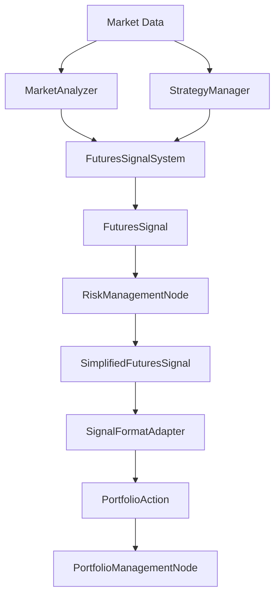

# 期货交易系统架构审查报告

## 执行摘要

**架构影响评估：高**

当前期货交易系统存在严重的架构问题，需要进行重大重构以确保系统的可维护性、可扩展性和可靠性。

### 关键发现
- ❌ 违反SOLID原则：多个组件职责不清晰
- ❌ 存在架构反模式：过度抽象、循环依赖风险
- ⚠️ 信号流转过于复杂：多层包装和转换
- ⚠️ 组件耦合度高：难以独立测试和维护

---

## 1. 架构现状分析

### 1.1 系统组件层级

```
FuturesAgent (代理层)
    ├── FuturesWorkflowFactory (工作流工厂)
    └── Workflow Graph (图执行引擎)
        ├── FuturesRiskManagementNode (风险管理节点)
        │   ├── FuturesSignalSystem (信号系统)
        │   │   ├── StrategyManager (策略管理器)
        │   │   │   └── Multiple Strategies (具体策略)
        │   │   ├── MarketAnalyzer (市场分析器)
        │   │   ├── LeverageController (杠杆控制器)
        │   │   └── TPSLCalculator (止盈止损计算器)
        │   └── SignalFormatAdapter (信号适配器)
        └── FuturesPortfolioManagementNode (投资组合管理节点)
            └── MarginManager (保证金管理器)
```

### 1.2 数据流分析



**问题**：信号经过多次转换（FuturesSignal → SimplifiedFuturesSignal → PortfolioAction），增加了系统复杂性和出错风险。

---

## 2. SOLID原则违反分析

### 2.1 单一职责原则（SRP）违反

#### FuturesSignalSystem类（1616行代码）
- **问题**：承担过多职责
  - 信号生成
  - 风险评估
  - 仓位计算
  - 止盈止损计算
  - 性能统计
  - 缓存管理
- **影响**：类过于庞大，难以维护和测试

#### MarketAnalyzer类（2170行代码）
- **问题**：混合了多种分析职责
  - 波动率分析
  - 成交量分析
  - 技术指标计算
  - 相关性分析
  - 情绪分析
  - 风险计算
- **影响**：修改任何分析逻辑都可能影响其他功能

### 2.2 开闭原则（OCP）违反

#### 信号格式硬编码
```python
# 在FuturesRiskManagementNode中定义内部类
class SimplifiedFuturesSignal:
    def __init__(self, ticker, direction, confidence, leverage, position_size):
        # 硬编码的信号结构
```
- **问题**：添加新的信号类型需要修改现有代码
- **影响**：扩展性差

### 2.3 里氏替换原则（LSP）潜在违反

#### 信号类型不一致
- FuturesSignal (data_models.py)
- SimplifiedFuturesSignal (内部类)
- PositionOperation (枚举)
- TradingDirection (枚举)

不同的信号表示方式无法互相替换。

### 2.4 接口隔离原则（ISP）违反

#### 过大的接口
```python
class FuturesSignalSystem:
    # 30+ 公开方法
    def generate_signal()
    def initialize()
    def get_system_status()
    def reset_performance_stats()
    def clear_cache()
    # ... 等等
```
- **问题**：客户端被迫依赖不需要的方法
- **影响**：增加耦合度

### 2.5 依赖倒置原则（DIP）违反

#### 直接依赖具体实现
```python
def __init__(self):
    self.signal_adapter = FuturesSignalFormatAdapter()  # 直接实例化
```
- **问题**：高层模块依赖低层模块的具体实现
- **影响**：难以替换和测试

---

## 3. 架构模式与反模式识别

### 3.1 识别的设计模式

✅ **工厂模式**
- FuturesWorkflowFactory
- StrategyFactory

✅ **适配器模式**
- SignalFormatAdapter
- MarketSignalBridge

✅ **策略模式**
- 多种交易策略的实现

### 3.2 识别的反模式

❌ **上帝对象（God Object）**
- FuturesSignalSystem：1616行，过多职责
- MarketAnalyzer：2170行，知道太多

❌ **意大利面条代码（Spaghetti Code）**
- 信号转换流程复杂交织
- SimplifiedFuturesSignal定义在方法内部

❌ **过度工程（Over-Engineering）**
- 5层抽象（Agent→Node→System→Manager→Strategy）
- 多次信号格式转换

❌ **贫血模型（Anemic Domain Model）**
- 数据模型缺乏行为，逻辑分散在各处

❌ **循环依赖风险**
- FuturesSignalSystem ↔ MarketAnalyzer
- RiskManagementNode → SignalSystem → MarketAnalyzer

---

## 4. 抽象层级分析

### 当前抽象层级
1. **Agent层**：顶层协调
2. **Workflow层**：工作流编排
3. **Node层**：业务节点
4. **System层**：业务系统
5. **Manager层**：管理器
6. **Strategy层**：具体策略

### 问题分析
- **过度抽象**：6层抽象对于当前系统规模过于复杂
- **职责模糊**：System和Manager层职责重叠
- **认知负担**：开发者需要理解过多层级才能修改功能

### 建议的简化层级
1. **Service层**：业务服务（信号、风险、投资组合）
2. **Domain层**：领域模型和业务逻辑
3. **Infrastructure层**：外部接口和适配器

---

## 5. 关键架构问题详解

### 5.1 信号流转复杂性

**当前流程**：
```
市场数据 → 策略分析 → FuturesSignal → SimplifiedFuturesSignal →
格式适配 → PortfolioAction → 执行
```

**问题**：
- 3次信号转换
- 每次转换都可能丢失信息
- 调试困难

**建议**：
- 统一信号模型
- 使用领域事件而非多次转换

### 5.2 职责重叠

**MarketAnalyzer vs StrategyManager**：
- 都在分析市场数据
- 都在生成交易信号
- 边界不清晰

**建议**：
- MarketAnalyzer：纯粹的市场数据分析
- StrategyManager：基于分析的策略决策

### 5.3 耦合度问题

**高耦合示例**：
```python
class FuturesRiskManagementNode:
    def __init__(self):
        self.signal_adapter = FuturesSignalFormatAdapter()  # 紧耦合
```

**建议**：
- 依赖注入
- 接口定义
- 控制反转

---

## 6. 性能与可扩展性评估

### 6.1 性能瓶颈
- 大类加载慢（2000+行代码）
- 多层转换开销
- 缺乏异步处理优化

### 6.2 可扩展性限制
- 添加新策略需要修改多处
- 信号格式固定，难以适应新需求
- 测试困难，mock复杂

---

## 7. 重构建议

### 7.1 短期改进（1-2周）

#### 优先级1：拆分大类
```python
# 将FuturesSignalSystem拆分为：
- SignalGenerator (信号生成)
- RiskAssessor (风险评估)
- PositionCalculator (仓位计算)
- PerformanceTracker (性能跟踪)

# 将MarketAnalyzer拆分为：
- VolatilityAnalyzer
- VolumeAnalyzer
- TechnicalIndicatorCalculator
- SentimentAnalyzer
```

#### 优先级2：统一信号模型
```python
@dataclass
class UnifiedTradingSignal:
    """统一的交易信号模型"""
    symbol: str
    action: TradingAction  # 统一的动作枚举
    confidence: float
    metadata: Dict[str, Any]  # 扩展信息

    def to_portfolio_action(self) -> PortfolioAction:
        """内置转换方法"""
        pass
```

#### 优先级3：引入依赖注入
```python
class FuturesRiskManagementNode:
    def __init__(self, signal_adapter: ISignalAdapter):
        self.signal_adapter = signal_adapter  # 接口注入
```

### 7.2 中期改进（1个月）

#### 重构架构为三层
```
Application Layer (应用层)
├── FuturesAgent
└── API Controllers

Domain Layer (领域层)
├── TradingSignal (领域模型)
├── RiskPolicy (业务规则)
└── TradingStrategy (策略接口)

Infrastructure Layer (基础设施层)
├── BinanceAdapter
├── DataProviders
└── MessageBrokers
```

#### 实施领域驱动设计（DDD）
- 定义清晰的限界上下文
- 使用领域事件代替直接调用
- 聚合根管理一致性

### 7.3 长期改进（3个月）

#### 微服务化考虑
- 信号服务
- 风险服务
- 执行服务
- 分析服务

#### 事件驱动架构
```python
# 使用事件总线
class EventBus:
    def publish(self, event: DomainEvent):
        pass

    def subscribe(self, event_type: Type[DomainEvent], handler: Callable):
        pass

# 领域事件
@dataclass
class SignalGeneratedEvent(DomainEvent):
    signal: TradingSignal
    timestamp: datetime
```

---

## 8. 测试策略建议

### 8.1 单元测试改进
- 拆分大类后更容易测试
- 使用依赖注入便于mock
- 每个类一个测试文件

### 8.2 集成测试
```python
# 端到端测试示例
def test_signal_flow():
    # Given: 市场数据
    market_data = create_test_market_data()

    # When: 执行信号流
    signal = signal_service.generate(market_data)
    risk_result = risk_service.assess(signal)
    action = portfolio_service.execute(risk_result)

    # Then: 验证结果
    assert action.is_valid()
```

### 8.3 性能测试
- 基准测试大类拆分前后性能
- 监控信号生成延迟
- 压力测试并发处理能力

---

## 9. 实施路线图

### 第1阶段：清理技术债务（第1-2周）
- [ ] 拆分FuturesSignalSystem
- [ ] 拆分MarketAnalyzer
- [ ] 移除SimplifiedFuturesSignal内部类
- [ ] 统一日志格式

### 第2阶段：架构优化（第3-4周）
- [ ] 实施依赖注入
- [ ] 定义清晰接口
- [ ] 简化抽象层级
- [ ] 优化数据流

### 第3阶段：功能增强（第2个月）
- [ ] 添加监控和度量
- [ ] 改进错误处理
- [ ] 实施缓存策略
- [ ] 性能优化

### 第4阶段：长期演进（第3个月起）
- [ ] 评估微服务拆分
- [ ] 实施事件驱动
- [ ] 容器化部署
- [ ] 自动化测试完善

---

## 10. 风险与缓解措施

### 风险1：重构影响现有功能
**缓解**：
- 充分的测试覆盖
- 分阶段实施
- 特性开关控制

### 风险2：团队学习成本
**缓解**：
- 编写详细文档
- 代码审查
- 知识分享会

### 风险3：性能退化
**缓解**：
- 基准测试
- 性能监控
- 渐进式优化

---

## 11. 结论

当前期货交易系统存在严重的架构问题，主要表现为：

1. **违反SOLID原则**：特别是单一职责原则
2. **存在多个反模式**：上帝对象、过度工程等
3. **抽象层级过深**：6层抽象增加复杂性
4. **信号流转复杂**：多次不必要的转换

建议立即开始第一阶段的重构工作，重点是拆分大类和统一信号模型。这将显著提高代码的可维护性和可测试性。

中长期应该考虑采用领域驱动设计和事件驱动架构，以支持系统的持续演进和扩展。

---

## 附录A：代码度量

| 组件 | 代码行数 | 方法数 | 圈复杂度 | 耦合度 |
|-----|---------|--------|---------|--------|
| FuturesSignalSystem | 1616 | 30+ | 高 | 高 |
| MarketAnalyzer | 2170 | 40+ | 高 | 中 |
| FuturesRiskManagementNode | 977 | 20+ | 中 | 高 |
| StrategyManager | 842 | 25+ | 中 | 中 |

## 附录B：重构前后对比

### 重构前
```python
# 1600+行的巨类
class FuturesSignalSystem:
    def generate_signal(self, ...):
        # 500行的方法
        # 做了太多事情
```

### 重构后
```python
# 职责单一的服务
class SignalGeneratorService:
    def __init__(self, analyzer: IMarketAnalyzer, calculator: IPositionCalculator):
        self.analyzer = analyzer
        self.calculator = calculator

    def generate_signal(self, market_data: MarketData) -> TradingSignal:
        # 50行清晰的编排逻辑
        analysis = self.analyzer.analyze(market_data)
        position = self.calculator.calculate(analysis)
        return TradingSignal(analysis, position)
```

---

*报告生成时间：2025-09-17*
*审查者：AI架构审查系统*
*版本：1.0*